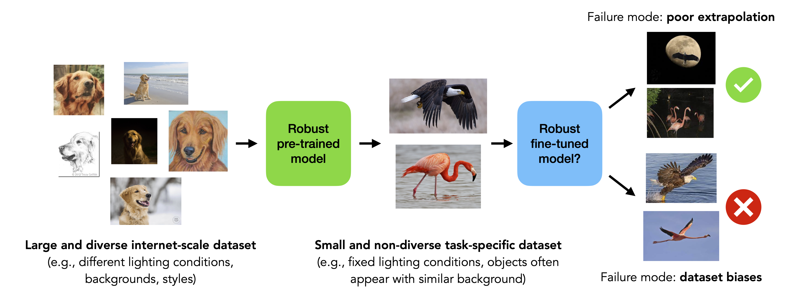

# Ask Your Distribution Shift if Pre-Training is Right for You

This repository contains the code for our paper:

**Ask Your Distribution Shift if Pre-Training is Right for You** </br>
*Benjamin Cohen-Wang, Joshua Vendrow, Aleksander Madry* </br>
**Paper**: https://arxiv.org/abs/TODO <br>
**Blog post**: http://gradientscience.org/TODO/



## Setting up

*Our code relies on our [FFCV Library](https://ffcv.io/). To install this library, along with other dependencies including PyTorch, follow the instructions below.*

```bash
conda create pretraining_robustness python=3.9 cupy pkg-config libjpeg-turbo opencv pytorch torchvision cudatoolkit=11.6 numba tqdm matplotlib seaborn jupyterlab ipywidgets cudatoolkit-dev scikit-learn scikit-image -c conda-forge -c pytorch
conda activate pretraining_robustness
pip install ffcv
pip install timm
pip install open-clip-torch
pip install wilds
```

You are now ready to run our code!

## Experiment management

The experiments in our paper involve training and fine-tuning many models in order to (1) establish baselines for effective robustness and (2) evaluate the effective robustness of pre-trained models above this baseline.
Our experiments are constructed as instances of an `ExperimentManager` object (defined in [src/experiment_manager/base.py](src/experiment_manager/base.py)).
This framework lets a user to define a distribution shift and configurations for models to be trained or fine-tuned.
After an experiment manager is defined, it can be easily used to train and evaluate models.

Please see [notebooks/example_experiment.ipynb](notebooks/example_experiment.ipynb) for a simple example in which we train a model on CIFAR-10 and evaluate its robustness to a change in brightness.

## Evaluating the robustness benefits of pre-training on synthetic in-support and out-of-support distribution shifts

In our paper, we first construct synthetic in-support and out-of-support shifts by modifying ImageNet, and illustrate that fine-tuning a pre-trained model does not improve robustness to the former but can improve robustness to the latter.
The following are the steps needed to reproduce our results and evaluate the robustness benefits of pre-training on your own synthetic shifts.

### Writing ImageNet in FFCV format

Our synthetic shifts are created by modifying the [ImageNet](https://www.image-net.org/index.php) dataset. 
Please set `IMAGENET_PATH` in [src/paths.py](src/paths.py) to the directory containing ImageNet (in the standard format expected by PyTorch).
To accelerate training, we'll write ImageNet in FFCV format.
To do so, first set `IMAGENET_FFCV_BASE_PATH` and `IMAGENET_LABELS_BASE_PATH` in [src/paths.py](src/paths.py) to paths that will contain the rewritten dataset (more detailed instructions in [src/paths.py](src/paths.py)).
Next, run the following two commands to write ImageNet (both the training and validation splits) in FFCV format (this may take a few minutes):

```
python -m scripts.write_imagenet_ffcv train
python -m scripts.write_imagenet_ffcv val
```

### Picking a distribution shift

In [src/experiments/imagenet_synthetic_shift.py](src/experiments/imagenet_synthetic_shift.py), we provide code for
1. Defining a synthetic distribution shift.
2. Training models from scratch on the reference dataset.
3. Fine-tuning pre-trained models on the reference dataset.
4. Evaluating models on shifted and reference datasets.

We pre-define a few distribution shifts that we present in our paper at the bottom of [src/experiments/imagenet_synthetic_shift.py](src/experiments/imagenet_synthetic_shift.py).
We'll be working with the `tint_p=0.5` distribution shift (in which under the reference distribution, we apply a tint that is spuriously correlated with the class).

### Training models from scratch

We provide scripts to train multiple models in parallel using SLURM. 
Note that these may need to be modified.
To train models from scratch, run the following command:

```
bash scripts/imagenet_synthetic_shift_baseline.sh tint_p=0.5
```

Under the hood, this command launches jobs to (1) train a model from scratch and (2) evaluate this model at different epochs to establish a baseline for robustness.

### Fine-tuning pre-trained models

To fine-tune pre-trained models (in this case, [CLIP](https://arxiv.org/abs/2103.00020) and [AugReg](https://arxiv.org/pdf/2106.10270)), run the following command:

```
bash scripts/imagenet_synthetic_shift_pretrained.sh tint_p=0.5
```

This script first fine-tunes the pre-trained models with different learning rates, and then fine-tunes a few copies of the pre-trained model with the learning rate that yields the best reference accuracy.

To fine-tune pre-trained models with different hyperparameter choices (besides learning rate), run the following command:

```
bash scripts/imagenet_synthetic_shift_hparam.sh tint_p=0.5
```

### Visualizing and computing effective robustness

After you've trained models from scratch and fine-tuned pre-trained models, we provide a notebook for computing effective robustness and visualizing results in [notebooks/imagenet_synthetic_shift.ipynb](notebooks/imagenet_synthetic_shift.ipynb).

## Splitting a distribution shift into in-support and out-of-support components

In our paper, we divide natural distribution shifts of ImageNet into in-support and out-of-support splits.
The following are the steps needed to reproduce this experiment.

### Writing ImageNet and its distribution shifts in FFCV format

We work with three shifted datasets: [ImageNet-V2](https://github.com/modestyachts/ImageNetV2), [ImageNet Sketch](https://github.com/HaohanWang/ImageNet-Sketch) and [ImageNet-R](https://github.com/hendrycks/imagenet-r).
To run this experiment, please download these datasets and set the paths in [src/paths.py](src/paths.py) accordingly.

Splitting a distribution shift of ImageNet requires training a model to distinguish between examples from ImageNet and a particular shifted dataset.
This requires creating a single file containing these datasets (and the original ImageNet dataset) in FFCV format.
To write this dataset, run the following command:

```
python -m scripts.write_imagenet_with_ood_ffcv
```

### Evaluating ImageNet models

For this experiment, we evaluate models trained from scratch on ImageNet and pre-trained models fine-tuned on ImageNet from [timm](https://timm.fast.ai).
The exact list of models (and other details of this experiment) can be found in [src/experiments/splitting_shifts/imagenet.py](src/experiments/splitting_shifts/imagenet.py).
To evaluate these models on the ImageNet validation set and distribution shifts, run the following SLURM command (which may need to be modified for your system):

```
sbatch --array=0-132 scripts/splitting_imagenet_shifts.sbatch evaluate
```

### Splitting shifted datasets

We split a shifted dataset in two steps.
First, we train models to distinguish between ImageNet and the shifted dataset with different hyperparameters.
To do so (in this case, for ImageNet Sketch), run the following command:

```
sbatch --array=0-7 scripts/splitting_imagenet_shifts.sbatch tune_estimate_support sketch_val
```

Second, using the best hyperparameters, we estimate the probability of each example being drawn from the shifted distribution, as opposed to ImageNet.
We divide the dataset into 10 folds, and train a separate model for each fold.
To do so, run the following command:

```
sbatch --array=0-9 scripts/splitting_imagenet_shifts.sbatch estimate_support sketch_val
```

### Visualizing results

We provide a notebook for visualizing results in [notebooks/splitting_imagenet_shifts.ipynb](notebooks/splitting_imagenet_shifts.ipynb).

## Maintainers

* [Benjamin Cohen-Wang](https://twitter.com/bcohenwang)
